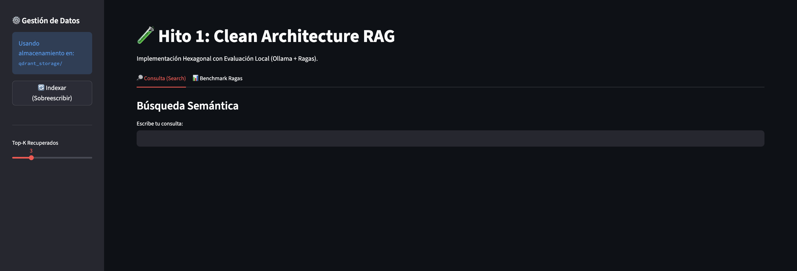
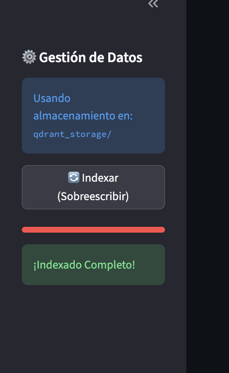
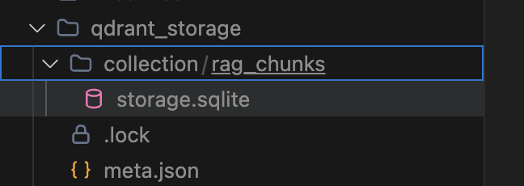
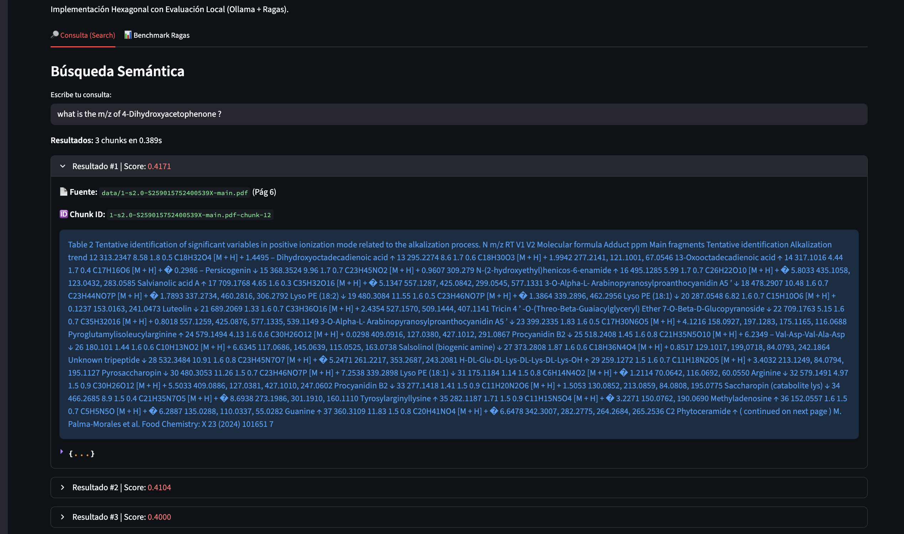
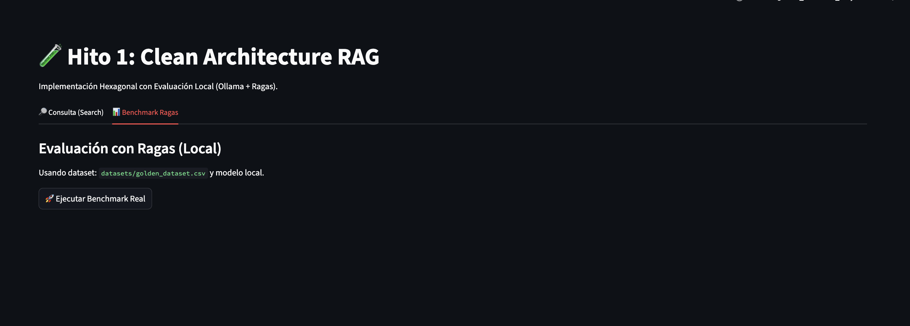

---

RAG Hito 1: Clean Architecture

This project implements a Retrieval-Augmented Generation (RAG) system using Hexagonal Architecture.  
It uses Streamlit for the UI and Qdrant for vector storage.

Quick Start

This project uses uv for fast dependency management.

1. Prerequisites

Ensure you have uv installed:

MacOS / Linux  
```bash
curl -LsSf https://astral.sh/uv/install.sh | sh 
```


Project Structure
```
.
├── .env                   Environment variables (API Keys)  
├── data/                  Place your PDF documents here  
├── app.py                 Streamlit Entry Point (UI)  
├── pyproject.toml         Dependencies (optional if using uv directly)  
└── src/  
    ├── domain/            Entities (ProcessedChunk, etc.)  
    ├── application/       Ports (Interfaces) & Services (Use Cases)  
    └── infrastructure/    Adapters (PDFLoader, Qdrant, HuggingFace)
```

To install depdencies for local run:

```bash
brew install ollama
```

In one terminal run :
```bash
ollama serve
ollama pull qwen2.5:1.5b
```

In another terminal run:
```bash
uv sync  
uv run streamlit run app.py
```

To Run generate test dataset or run eval use :

```bash
uv run src/scripts/generate_test_dataset.py
uv run python src/scripts/run_eval.py
```


# How to Use

After running the app.py



First you have to index the documents in the data folder, for this versión we use a few since the embedder is running locally. 



After this step a collection will be generated:


file, you will be able to use the Retrieval in the UI.

You can searh for a query and see the results using for example the following query:
```
what is the m/z of 4-Dihydroxyacetophenone ?
```



You can also execute the benchamrk in the UI, this will not create the golden dataset, but it will show you the results of the benchmark.


# Datsaset Generation

To generate the dataset use:
```bash
uv run src/scripts/generate_test_dataset.py
```

this will generate a dataset in the datasets folder it takes like 30 min.